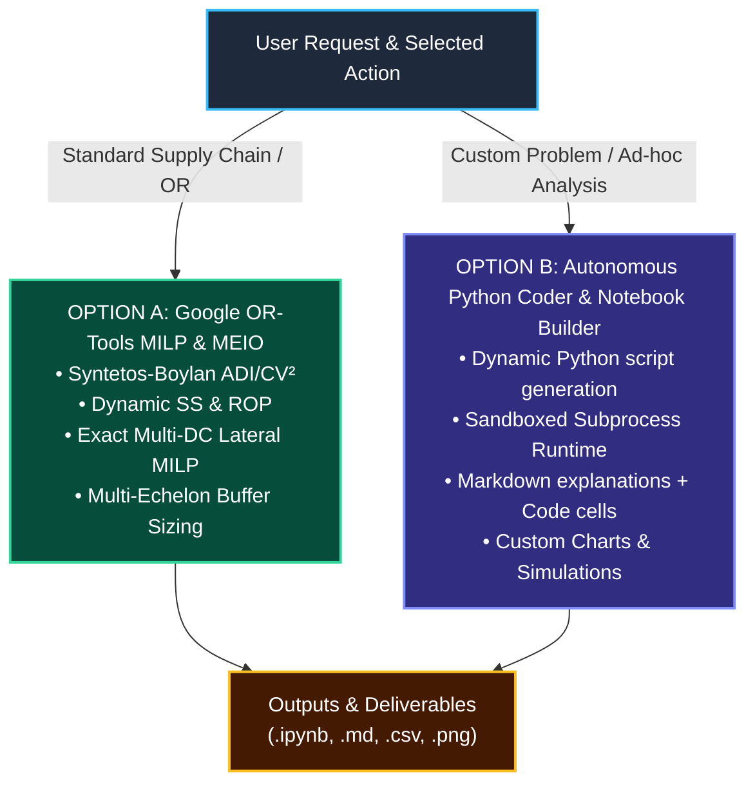
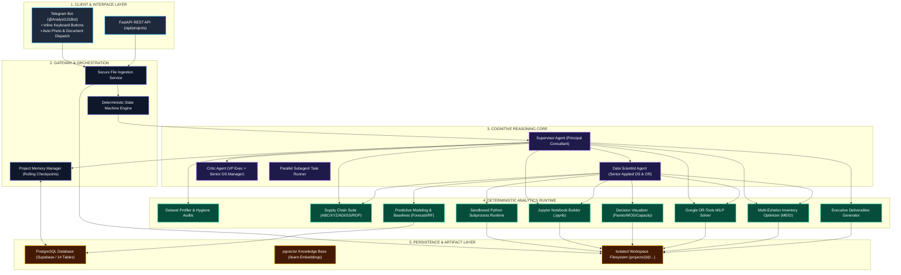

# 📊 Autonomous Business Analytics Operating System

An enterprise-grade autonomous Business Analytics platform that combines **consultant-level business framing and synthesis** with **Google OR-Tools exact MILP optimization, Multi-Echelon Inventory Optimization (MEIO), dynamic Python code execution, interactive Jupyter Notebook creation, rolling checkpoint memory, and state machine quality gates**.

---

## 📖 Table of Contents
1. [User Guide: How to Use This Properly](#-user-guide-how-to-use-this-properly)
2. [Interactive Telegram Inline Keyboard Buttons](#-interactive-telegram-inline-keyboard-buttons)
3. [Dual Execution Engine (OR-Tools vs Custom Python Notebooks)](#-dual-execution-engine)
4. [Multi-Echelon MEIO Optimization](#-multi-echelon-inventory-optimization-meio)
5. [Rolling Checkpoint Summarization & Parallel Tasks](#-rolling-checkpoint-summarization--parallel-tasks)
6. [What to Expect (Outputs & Deliverables)](#-what-to-expect-outputs--deliverables)
7. [System Architecture Diagram](#-system-architecture-diagram)
8. [Mathematical Formulations Implemented](#-mathematical-formulations-implemented)
9. [Deployment & 24/7 Operation Guide](#-deployment--247-operation-guide)
10. [Automated Tests & Quality Verification](#-automated-tests--quality-verification)

---

## 🚀 User Guide: How to Use This Properly

The system operates like a senior consulting team and data science lab working together. Follow this 5-step workflow:


---

## 📱 Interactive Telegram Interface & Proactive User Guidance

The Telegram bot acts as an interactive executive copilot that **actively guides the user at every phase of analysis**:

```text
┌────────────────────────────────────────────────────────┐
│  [✅ Approve & Run OR-Tools]   [📓 Build Python Notebook] │
│  [🌐 Multi-Echelon MEIO]      [📊 Render Decision Charts] │
└────────────────────────────────────────────────────────┘
```

- **`[✅ Approve & Run OR-Tools]`**: Instantly solves the exact Mixed-Integer Linear Program (MILP) for multi-DC lateral inventory rebalancing, dynamic stocking policies, and vendor returns.
- **`[📓 Build Python Notebook]`**: Commands the agent to dynamically write custom Python code, run exploratory data analysis, and compile a self-contained interactive Jupyter Notebook (`.ipynb`).
- **`[🌐 Multi-Echelon MEIO]`**: Computes Central Hub (CDC) vs Regional Spoke (RDC) buffer sizing and square-root risk pooling efficiency.
- **`[📊 Render Decision Charts]`**: Dispatches 300 DPI high-resolution Pareto velocity curves and warehouse pallet capacity charts directly to your chat.

### 💬 Proactive Communication & Resilient Messaging
- **Awaiting Input Prompts:** The bot never leaves users in the dark. After file ingestion, intermediate calculations, or recommendation proposals, it explicitly communicates:
  - What has been processed and stored in the workspace.
  - What decision, input, or next step is required from the stakeholder.
  - One-click buttons and textual examples to trigger the next action.
- **Safe Markdown & Error Fallback:** Integrated message sanitization and automatic fallback mechanisms ensure that complex dataset columns, formulas, and long reports are delivered seamlessly without entity parse errors.

---

## 🔬 Dual Execution Engine



### Option A: Google OR-Tools Exact MILP Rebalancing
Formulates lateral network inventory transfers as an exact Mixed-Integer Linear Program (MILP):
$$\min \sum_{i,j,k} \left( c_{ij} x_{ijk} - 1.5 \cdot \text{Cost}_k \cdot x_{ijk} \right)$$
Subject to:
1. **Source DC Remaining Inventory:** $\sum_j x_{ijk} \le \max(0, \text{On-Hand}_{ik} - SS_{ik})$
2. **Destination Shortage Relief:** $\sum_i x_{ijk} \le \max(0, ROP_{jk} - (\text{On-Hand}_{jk} + \text{On-Order}_{jk}))$
3. **Lead-Time Advantage:** $T_{ij} < \text{Supplier Lead Time } L_{jk}$

---

## 🌐 Multi-Echelon Inventory Optimization (MEIO)

When analyzing multi-tier distribution networks (e.g. Central Distribution Center $\to$ Regional Fulfillment Centers):
- **Guaranteed-Service Buffer Allocation:**
  - **Decentralized Model:** Each regional DC holds safety stock for the entire supplier lead time $L_{\text{supplier}}$.
  - **Multi-Echelon MEIO Model:** Central DC pools safety stock for net lead time $(L_{\text{supplier}} - L_{\text{internal}})$, and regional DCs hold echelon buffer for short internal transit $L_{\text{internal}}$.
- **Risk Pooling Gain:** Evaluates square-root variance pooling $\sqrt{\sum \sigma_i^2} < \sum \sigma_i$, unlocking **15%–35% working capital reduction** while maintaining target service levels.

---

## 🧠 Rolling Checkpoint Summarization & Parallel Tasks

1. **Rolling Checkpoint Summarization:**  
   To prevent linear LLM token growth in long-running projects (20+ turns), the system automatically compresses older conversation turns into structured memory checkpoints in `project_state`. Prompt token overhead remains flat and response latency stays fast.
2. **Parallel Subagent Task Runner:**  
   Executes independent analytical tasks (e.g. multi-SKU demand forecasting, velocity classification, and MEIO simulations) concurrently via async coroutines.

---

## 📦 What to Expect (Outputs & Deliverables)

Whenever an analysis is executed, you receive **4 distinct deliverable tiers**:

### 1. 💬 Telegram Real-Time Synthesis
- Executive markdown summary detailing financial impact (**Inventory Repositioned**, **Working Capital Released**, **Holding Cost Saved**, **Cash Recovered**).
- **Auto-Dispatched Photo Attachments:** 300 DPI decision charts delivered directly to Telegram.
- **Auto-Dispatched Document Attachments:** Line-item CSV action queues, technical markdown reports, and `.ipynb` Jupyter Notebooks delivered as files.

### 2. 📁 Project Workspace Files (`projects/{project_id}/`)
```text
projects/{project_id}/
├── raw/                                 # Untouched original input files
├── cleaned/                             # Sanitized datasets with raw/clean columns
├── analysis/
│   ├── sku_velocity_segmentation.csv   # ABC (Dollar/Unit), XYZ, ADI, CV², Demand Patterns
│   ├── stocking_policy_evaluation.csv  # Dynamic SS, ROP, Order-Up-To, Excess $, Shortage $
│   └── multi_echelon_meio_evaluation.csv # Hub-and-Spoke risk pooling & echelon buffers
├── charts/
│   ├── pareto_velocity_curve.png       # 300 DPI Cumulative Dollar vs Unit Volume
│   ├── inventory_coverage_vs_target.png# Current WOS vs Recommended Policy
│   └── dc_pallet_capacity_utilization.png # Dedicated vs Occupied Pallet Racks
└── outputs/
    ├── Executive_Strategy_Memo.md      # 1-page board-level briefing & 30-60-90 day roadmap
    ├── Technical_Analytics_Report.md   # Comprehensive technical report & critic audit
    ├── rebalance_action_queue.csv      # Operational transfer orders (OR-Tools MILP optimal)
    ├── disposition_action_queue.csv    # Vendor returns & scrap clearance
    └── custom_analysis.ipynb           # Custom Python notebook built by the agent
```

---

## 🏛️ System Architecture Diagram



---

## ⚡ Deployment & 24/7 Operation Guide

```powershell
cd "c:\Users\Diandra Riando\OneDrive\Documents\Python Project\business_analytics_os"
python run_bot.py
```

---

## 🧪 Automated Tests & Quality Verification

Run the full 27-test test suite:
```powershell
cd "c:\Users\Diandra Riando\OneDrive\Documents\Python Project\business_analytics_os"
$env:PYTEST_DISABLE_PLUGIN_AUTOLOAD="1"; python -m pytest -p asyncio tests/ -v
```

```text
============================= 27 passed in 21.37s =============================
```
