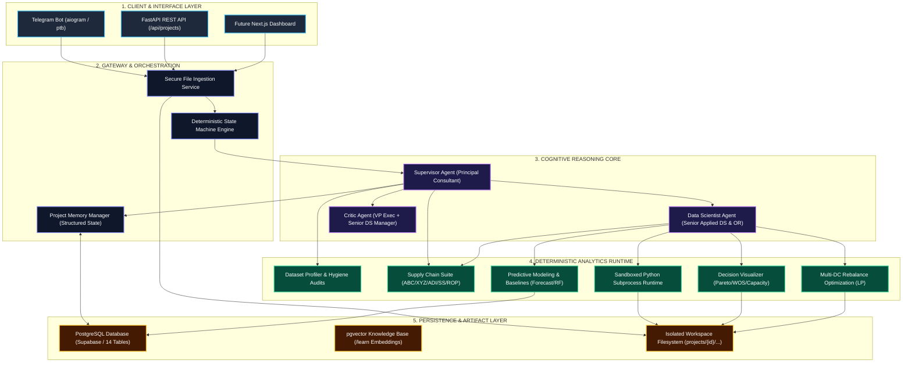
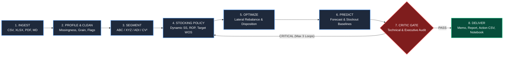

# 📊 Autonomous Business Analytics Operating System

An enterprise-grade autonomous Business Analytics platform that combines **consultant-level business framing and synthesis** with **deterministic Python computation, operations research optimization, statistical modeling, and state machine quality gates**.

---

## 🏛️ System Architecture Diagram



---

## ⚡ Deployment & 24/7 Operation Guide

### Is the Agent Online 24/7 or Only When My Laptop Runs?

| Deployment Mode | Availability | How It Works |
| :--- | :--- | :--- |
| **Mode 1: Local Laptop (Current)** | Only while laptop is awake and `python run_bot.py` is running | The bot runs on your local machine and polls Telegram. If you close your laptop, the bot pauses. |
| **Mode 2: 24/7 Cloud Deployment (Docker / VPS)** | **24/7 Continuous** | The container runs on a cloud server (e.g., Railway, Render, Fly.io, AWS EC2, or DigitalOcean). It remains online 24/7 without needing your laptop. |

> [!NOTE]
> **Zero Data Loss on Restart:**  
> Because the database is hosted in **Supabase PostgreSQL Cloud**, all user conversations, project state machine phases, uploaded metadata, decisions, and assumptions are permanently preserved. You can stop and restart your laptop anytime and resume exactly where you left off.

---

### How to Start the Agent

#### 1. Running the Telegram Bot Locally
```powershell
cd "c:\Users\Diandra Riando\OneDrive\Documents\Python Project\business_analytics_os"
python run_bot.py
```
*Open Telegram and message [@Analyst131Bot](https://t.me/Analyst131Bot).*

#### 2. Running the FastAPI REST API Server
```powershell
cd "c:\Users\Diandra Riando\OneDrive\Documents\Python Project\business_analytics_os"
python -m uvicorn app.main:app --host 0.0.0.0 --port 8000 --reload
```
*API documentation available at `http://localhost:8000/docs`.*

#### 3. Running 24/7 with Docker Compose (Cloud or Home Server)
```bash
docker-compose up -d
```

---

## 🔄 End-to-End Analytical Pipeline Diagram



---

## 🧮 Mathematical Formulations Implemented

### 1. Velocity & Demand Intermittency Classification
- **ABC Dollar Volume:** Classified by Pareto cumulative dollar volume share ($A \le 80\%$, $B \le 95\%$, $C > 95\%$).
- **XYZ Demand Variability:** $CV = \frac{\sigma_D}{\bar{D}}$ ($X \le 0.5$, $Y \le 1.0$, $Z > 1.0$).
- **Syntetos-Boylan Intermittency Classification:**
  - **Average Demand Interval ($ADI$):** $ADI = \frac{N_{\text{total periods}}}{N_{\text{non-zero demand periods}}}$ (Cutoff threshold = 1.32).
  - **Squared Coefficient of Variation ($CV^2$):** $CV^2 = \left(\frac{\sigma_{\text{non-zero}}}{\mu_{\text{non-zero}}}\right)^2$ (Cutoff threshold = 0.49).
  - **Quadrants:**
    - **Smooth:** $ADI < 1.32, CV^2 < 0.49$ (regular demand, low variance)
    - **Erratic:** $ADI < 1.32, CV^2 \ge 0.49$ (regular demand, high variance)
    - **Intermittent:** $ADI \ge 1.32, CV^2 < 0.49$ (sporadic demand, low variance)
    - **Lumpy:** $ADI \ge 1.32, CV^2 \ge 0.49$ (sporadic demand, high variance)

### 2. Dynamic Stocking Policy & Buffer Sizing
- **Dynamic Safety Stock ($SS$):**
  $$SS = z \cdot \sqrt{L \cdot \sigma_D^2 + \bar{D}^2 \cdot \sigma_L^2}$$
  *(Where $z$ is the standard normal score corresponding to the SKU's target service level: $A=95\% \rightarrow z=1.645$, $B=90\% \rightarrow z=1.282$, $C=85\% \rightarrow z=1.036$)*.
- **Dynamic Reorder Point ($ROP$):**
  $$ROP = \bar{D} \cdot L + SS$$
- **Order-Up-To Level ($S$):**
  $$S = \bar{D} \cdot (L + R) + SS$$
  *(Where $R$ is the review cycle period in weeks)*.
- **Coverage (Weeks of Supply):**
  $$WOS = \frac{\text{On-Hand Inventory}}{\bar{D}_{\text{weekly}}}$$
- **Excess & Shortage Quantification:**
  $$\text{Excess} = \max(0, \text{On-Hand} - S), \quad \text{Shortage} = \max(0, ROP - (\text{On-Hand} + \text{On-Order}))$$

### 3. Lateral Multi-DC Network Rebalancing Optimization
- **Trigger Conditions:**
  - Origin DC $i$ is long ($\text{On-Hand}_i > S_i$) and Destination DC $j$ is short ($\text{On-Hand}_j < ROP_j$).
  - Origin DC remains safe post-transfer: $\text{On-Hand}_i - \text{Transfer} \ge SS_i$.
  - Transit days $T_{ij} < \text{Supplier Lead Time } L_j$.
  - Destination dedicated pallet capacity is not breached.
- **Economic Categorization:** Labeled strictly as `INVENTORY_REPOSITIONED` (not P&L savings).

---

## 📁 Repository Structure

```text
business_analytics_os/
├── .env.example               # Reference configuration template
├── .gitignore                 # Excludes secrets, cache, and project files
├── requirements.txt           # Python dependencies
├── README.md                  # System architecture and documentation
├── run_bot.py                 # Telegram Bot startup script
├── docker-compose.yml         # Container stack configuration
├── Dockerfile                 # Production Docker image definition
├── pytest.ini                 # Pytest runner configuration
├── app/
│   ├── config.py              # Pydantic Settings reading .env
│   ├── main.py                # FastAPI REST API server
│   ├── api/                   # REST API routes (/health, /projects, /artifacts)
│   ├── bot/                   # Telegram Bot handlers (/start, /learn, file upload, /status)
│   ├── core/                  # Deterministic State Machine & Project Memory
│   ├── agents/                # Cognitive Multi-Agent Reasoning Core
│   │   ├── base_agent.py      # Multi-turn tool execution loop
│   │   ├── supervisor.py      # Supervisor Agent (Principal Consultant)
│   │   ├── data_scientist.py  # Data Scientist Agent (Senior Applied DS & OR)
│   │   └── prompts/           # Specialized agent system prompts
│   ├── tools/                 # Deterministic Analytics & Modeling Tool Suite
│   │   ├── file_tools.py      # File ingestion & parsing
│   │   ├── profiling_tools.py # Dataset profiler & quality auditor
│   │   ├── runtime.py         # Sandboxed Python subprocess execution
│   │   ├── cleaning_tools.py  # Data hygiene & raw value preservation
│   │   ├── visualization_tools.py # Pareto, WOS Coverage, & Capacity charts
│   │   ├── supply_chain.py    # ABC/XYZ/ADI, Stocking Policy, Rebalance & Disposition
│   │   └── modeling.py        # Forecasting & Classification with Baselines
│   └── db/                    # SQLAlchemy async engine & Supabase models (14 tables)
└── tests/                     # Automated Pytest suite (21 tests)
```

---

## 🧪 Automated Tests

Run the full automated test suite:
```powershell
cd "c:\Users\Diandra Riando\OneDrive\Documents\Python Project\business_analytics_os"
python -m pytest
```
