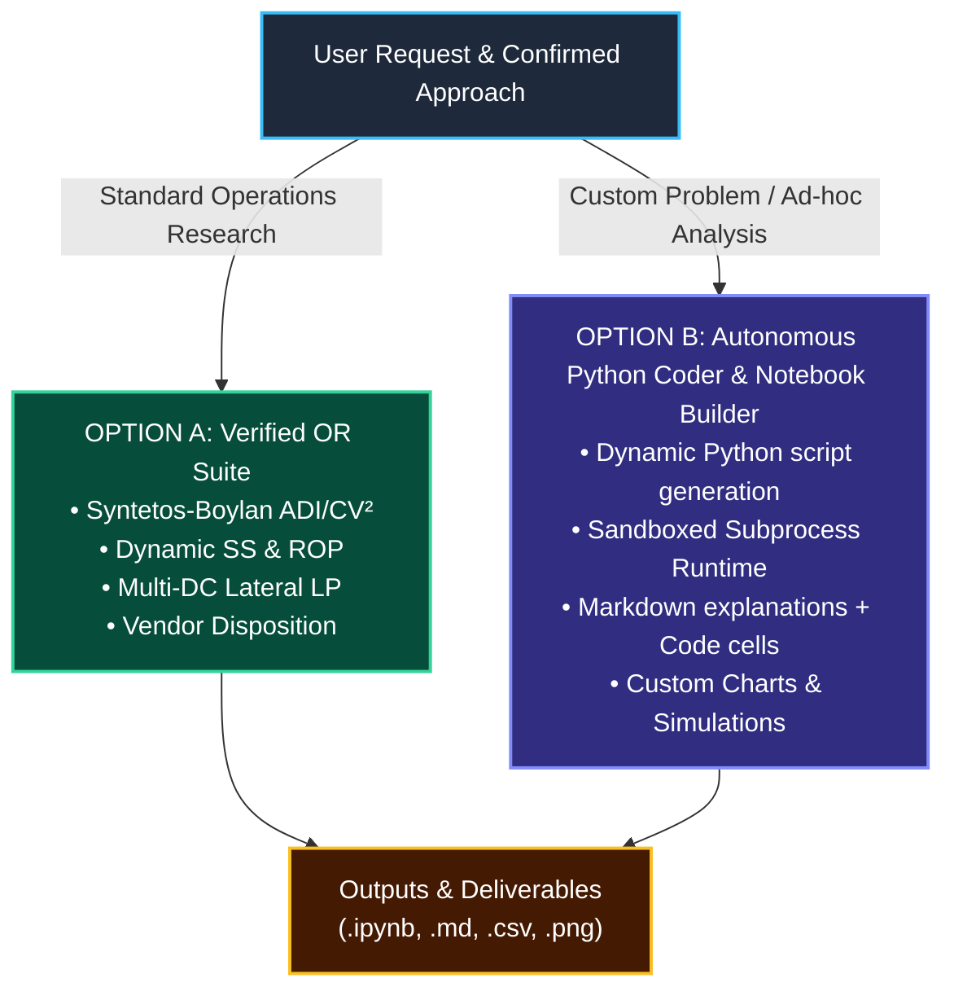
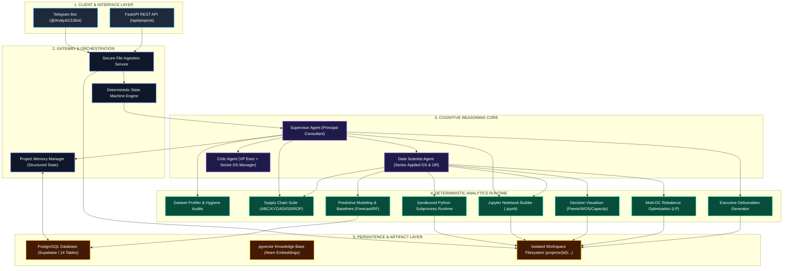

# 📊 Autonomous Business Analytics Operating System

An enterprise-grade autonomous Business Analytics platform that combines **consultant-level business framing and synthesis** with **dynamic Python code execution, operations research optimization, predictive statistical modeling, interactive Jupyter Notebook creation, and state machine quality gates**.

---

## 📖 Table of Contents
1. [User Guide: How to Use This Properly](#-user-guide-how-to-use-this-properly)
2. [Dual Execution Engine (OR Suite vs. Custom Python Notebooks)](#-dual-execution-engine-step-4-deep-dive)
3. [What to Expect (Outputs & Deliverables)](#-what-to-expect-outputs--deliverables)
4. [Telegram Bot Commands & Interactions](#-telegram-bot-commands--interactions)
5. [System Architecture Diagram](#-system-architecture-diagram)
6. [Mathematical Formulations Implemented](#-mathematical-formulations-implemented)
7. [Deployment & 24/7 Operation Guide](#-deployment--247-operation-guide)
8. [Automated Tests & Quality Verification](#-automated-tests--quality-verification)

---

## 🚀 User Guide: How to Use This Properly

The system operates like a senior consulting team and data science lab working together. Follow this 5-step workflow:


### Step 1: Initialize Your Project
- Open Telegram and message [@Analyst131Bot](https://t.me/Analyst131Bot).
- Send `/start` to see the onboarding overview.
- Send `/new <Project Title>` (e.g. `/new EV Supply Chain Optimization`) to create an isolated workspace and database state.

### Step 2: Upload Your Datasets
Attach your data files directly to the Telegram chat (or via REST API `POST /api/projects/{id}/files`):
- **Supply Chain Files:** `weekly_demand.csv`, `inventory_weekly.csv`, `parts.csv`, `transfer_lanes.csv`, `warehouses.csv`.
- **Custom Files:** Any custom CSV or Excel file (marketing data, financial logs, pricing tables, manufacturing logs).

### Step 3: Diagnostic Profiling & Approach Confirmation
- The bot will **never jump blindly into expensive calculations** or hallucinate numbers.
- It automatically audits missingness, duplicates, and grain, then **presents a structured analytical methodology and asks for your confirmation**:
  > *"I diagnosed 50 SKUs across 5 DCs. Reno DC is at 97% pallet capacity while Chicago faces stockout risk. I propose: 1) Syntetos-Boylan ADI/CV² velocity segmentation, 2) Dynamic Safety Stock with 95% service level for Class A, and 3) Lateral Rebalance LP. Do you approve these parameters?"*

### Step 4: Execution (Pre-built OR Suite OR Custom Python Notebook)
- You have **complete flexibility** on how the analysis is executed:
  - **Option A (Standard Supply Chain):** The agent executes verified operations research algorithms (Dynamic Safety Stock, ROP, Multi-DC Lateral Rebalance LP, Vendor Returns).
  - **Option B (Custom Dynamic Python & Jupyter Notebook):** Ask the agent to write custom Python scripts, run simulations, perform ad-hoc regressions, or build a custom Jupyter Notebook (`.ipynb`). The agent writes the code, executes it in a sandboxed subprocess, and outputs the resulting `.ipynb` and decision charts!

### Step 5: Critic Quality Gate & Final Deliverables
- The **Dual-Perspective Critic Agent** audits technical integrity (data hygiene, baseline comparisons, leakage prevention) and business sanity (DC pallet limits, freight ROI).
- Once approved, the system generates the **Executive Strategy Memo**, **Technical Report**, **Action CSVs**, and **Reproducible Jupyter Notebook**.

---

## 🔬 Dual Execution Engine (Step 4 Deep-Dive)

Step 4 is **NOT** limited to a fixed set of formulas. The system features a **Dual Execution Architecture**:



### Option A: Verified Supply Chain & Operations Research Suite
Use when solving multi-echelon inventory, warehouse bottlenecks, and replenishment policies:
1. **Syntetos-Boylan ADI / $CV^2$ Intermittency Segmentation:** Classifies demand into *Smooth*, *Erratic*, *Intermittent*, and *Lumpy*.
2. **Dynamic Stocking Policies:** Sizes Safety Stock ($SS = z \cdot \sqrt{L \cdot \sigma_D^2 + \bar{D}^2 \cdot \sigma_L^2}$), Reorder Points ($ROP$), and Order-Up-To levels ($S$).
3. **Lateral Network Rebalancing Optimization:** LP formulation matching long nodes with short nodes, checking freight costs and destination warehouse pallet limits.
4. **Lifecycle Disposition Routing:** Automatic routing to contractual vendor returns vs secondary clearance.

### Option B: Autonomous Python Coder & Custom Jupyter Notebook Builder
Use whenever you have **unique questions, custom datasets, or want custom data science**:
- You can tell the bot:
  - *"Can you write a Python notebook to analyze price elasticity across our parts?"*
  - *"Run a Monte Carlo simulation of lead time disruptions for 100 days."*
  - *"Build a clustering model on customer order frequency and create a Jupyter Notebook."*
- **What the Agent Does:**
  1. Dynamically writes structured Python code with data loading, calculations, and `matplotlib`/`seaborn` plotting.
  2. Executes the script in the **Sandboxed Python Runtime** with timeout protection.
  3. Formats the code and markdown explanations into an interactive **`.ipynb` Jupyter Notebook** saved in `projects/{id}/outputs/custom_analysis.ipynb`.
  4. Automatically uploads the generated charts and summaries to your Telegram chat.

---

## 📦 What to Expect (Outputs & Deliverables)

Whenever an analysis is executed, you receive **4 distinct deliverable tiers**:

### 1. 💬 Telegram Real-Time Synthesis
- Executive markdown summary detailing financial impact (**Inventory Repositioned**, **Working Capital Released**, **Holding Cost Saved**, **Cash Recovered**).
- **Auto-Dispatched Photo Attachments:** 300 DPI decision charts are delivered directly to your Telegram chat.
- **Auto-Dispatched Document Attachments:** Line-item CSV action queues and custom `.ipynb` files are sent as downloadable documents.

### 2. 📁 Project Workspace Files (`projects/{project_id}/`)
All outputs are structured on disk in isolated directories:
```text
projects/{project_id}/
├── raw/                         # Untouched original input files
├── cleaned/                     # Sanitized datasets with *_raw and *_clean columns
├── analysis/
│   ├── sku_velocity_segmentation.csv   # ABC (Dollar/Unit), XYZ, ADI, CV², Demand Patterns
│   └── stocking_policy_evaluation.csv  # Dynamic SS, ROP, Order-Up-To, Excess $, Shortage $
├── charts/
│   ├── pareto_velocity_curve.png       # 300 DPI Cumulative Dollar vs Unit Volume
│   ├── inventory_coverage_vs_target.png# Current WOS vs Recommended Policy
│   └── dc_pallet_capacity_utilization.png # Dedicated vs Occupied Pallet Racks
└── outputs/
    ├── Executive_Strategy_Memo.md      # 1-page board-level briefing & 30-60-90 day roadmap
    ├── Technical_Analytics_Report.md   # Comprehensive technical report & critic audit
    ├── rebalance_action_queue.csv      # Operational transfer orders (Origin, Dest, Qty, Cost)
    ├── disposition_action_queue.csv    # Vendor returns & scrap clearance
    ├── reproducible_analysis.ipynb     # Fully executable reproducible notebook
    └── custom_analysis.ipynb           # Custom Python notebook built by the agent
```

### 3. 🗄️ Supabase Cloud Database Persistence
Every transaction is permanently tracked in Supabase PostgreSQL:
- **`project_state`:** State machine transitions and memory snapshots.
- **`project_assumptions` & `project_decisions`:** Auditable log of all parameters and choices.
- **`data_quality_issues`:** Anomaly logs with treatments applied.
- **`model_runs`:** Registry of forecasts and classifiers with baseline vs model metrics.
- **`critic_reviews`:** Technical and business sign-off audits.
- **`recommendations`:** Prioritized action table with owners, impact, and effort.
- **`kb_documents`:** Vector-searchable library of ingested methodologies (`/learn`).

---

## 🤖 Telegram Bot Commands & Interactions

| Command | Action | Example |
| :--- | :--- | :--- |
| `/start` | Display onboarding guide and capabilities overview | `/start` |
| `/new <title>` | Initialize a new isolated analytics project | `/new Reno Warehouse Optimization` |
| `/projects` | List recent analytics projects and active phases | `/projects` |
| `/status` | View current project state, files, assumptions, and decisions | `/status` |
| `/learn` + file | Ingest domain whitepaper / SOP into Knowledge Base | Attach PDF with caption `/learn` |
| `/help` | Detailed help cheat-sheet | `/help` |

---

## 🏛️ System Architecture Diagram



---

## 🧮 Mathematical Formulations Implemented

### 1. Velocity & Demand Intermittency Classification
- **ABC Dollar Volume:** Classified by Pareto cumulative dollar volume share ($A \le 80\%$, $B \le 95\%$, $C > 95\%$).
- **XYZ Demand Variability:** $CV = \frac{\sigma_D}{\bar{D}}$ ($X \le 0.5$, $Y \le 1.0$, $Z > 1.0$).
- **Syntetos-Boylan Intermittency Classification:**
  - **Average Demand Interval ($ADI$):** $ADI = \frac{N_{\text{total periods}}}{N_{\text{non-zero demand periods}}}$ (Cutoff threshold = 1.32).
  - **Squared Coefficient of Variation ($CV^2$):** $CV^2 = \left(\frac{\sigma_{\text{non-zero}}}{\mu_{\text{non-zero}}}\right)^2$ (Cutoff threshold = 0.49).
  - **Demand Quadrants:**
    - **Smooth:** $ADI < 1.32, CV^2 < 0.49$ (regular demand, low variance)
    - **Erratic:** $ADI < 1.32, CV^2 \ge 0.49$ (regular demand, high variance)
    - **Intermittent:** $ADI \ge 1.32, CV^2 < 0.49$ (sporadic demand, low variance)
    - **Lumpy:** $ADI \ge 1.32, CV^2 \ge 0.49$ (sporadic demand, high variance)

### 2. Dynamic Stocking Policy & Buffer Sizing
- **Dynamic Safety Stock ($SS$):**
  $$SS = z \cdot \sqrt{L \cdot \sigma_D^2 + \bar{D}^2 \cdot \sigma_L^2}$$
  *(Where $z$ corresponds to the target service level: $A=95\% \rightarrow z=1.645$, $B=90\% \rightarrow z=1.282$, $C=85\% \rightarrow z=1.036$)*.
- **Dynamic Reorder Point ($ROP$):**
  $$ROP = \bar{D} \cdot L + SS$$
- **Order-Up-To Level ($S$):**
  $$S = \bar{D} \cdot (L + R) + SS$$
- **Coverage (Weeks of Supply):**
  $$WOS = \frac{\text{On-Hand Inventory}}{\bar{D}_{\text{weekly}}}$$
- **Excess & Shortage Quantification:**
  $$\text{Excess} = \max(0, \text{On-Hand} - S), \quad \text{Shortage} = \max(0, ROP - (\text{On-Hand} + \text{On-Order}))$$

### 3. Lateral Multi-DC Network Rebalancing Optimization
- **Trigger Conditions:**
  - Origin DC $i$ is long ($\text{On-Hand}_i > S_i$) and Destination DC $j$ is short ($\text{On-Hand}_j < ROP_j$).
  - Origin DC remains safe post-transfer: $\text{On-Hand}_i - \text{Transfer} \ge SS_i$.
  - Transit days $T_{ij} < \text{Supplier Lead Time } L_j$.
  - Destination dedicated pallet capacity is respected.
- **Economic Categorization:** Labeled strictly as `INVENTORY_REPOSITIONED` (not P&L savings).

---

## ⚡ Deployment & 24/7 Operation Guide

### Availability Modes

| Deployment Mode | Availability | How It Works |
| :--- | :--- | :--- |
| **Mode 1: Local Laptop (Current)** | While laptop is awake and `python run_bot.py` is running | The bot runs on your local machine. If you close your laptop, the bot pauses. |
| **Mode 2: 24/7 Cloud Deployment (Docker)** | **24/7 Continuous** | The container runs on a cloud VPS / host (Railway, Render, Fly.io, or AWS EC2). It stays online 24/7 without needing your laptop. |

> [!NOTE]
> **Zero Data Loss on Restart:**  
> Because the database is hosted in **Supabase PostgreSQL Cloud**, all user conversations, project state machine phases, uploaded metadata, decisions, and assumptions are permanently preserved. You can stop and restart your laptop anytime and resume exactly where you left off.

### How to Start the System

#### 1. Running the Telegram Bot Locally:
```powershell
cd "c:\Users\Diandra Riando\OneDrive\Documents\Python Project\business_analytics_os"
python run_bot.py
```

#### 2. Running the FastAPI REST API Server:
```powershell
cd "c:\Users\Diandra Riando\OneDrive\Documents\Python Project\business_analytics_os"
python -m uvicorn app.main:app --host 0.0.0.0 --port 8000 --reload
```
*Interactive Swagger docs: `http://localhost:8000/docs`.*

#### 3. Running 24/7 with Docker:
```bash
docker-compose up -d
```

---

## 🧪 Automated Tests & Quality Verification

Run the full 25-test test suite:
```powershell
cd "c:\Users\Diandra Riando\OneDrive\Documents\Python Project\business_analytics_os"
$env:PYTEST_DISABLE_PLUGIN_AUTOLOAD="1"; python -m pytest -p asyncio tests/ -v
```

```text
============================= 25 passed in 33.74s =============================
```
